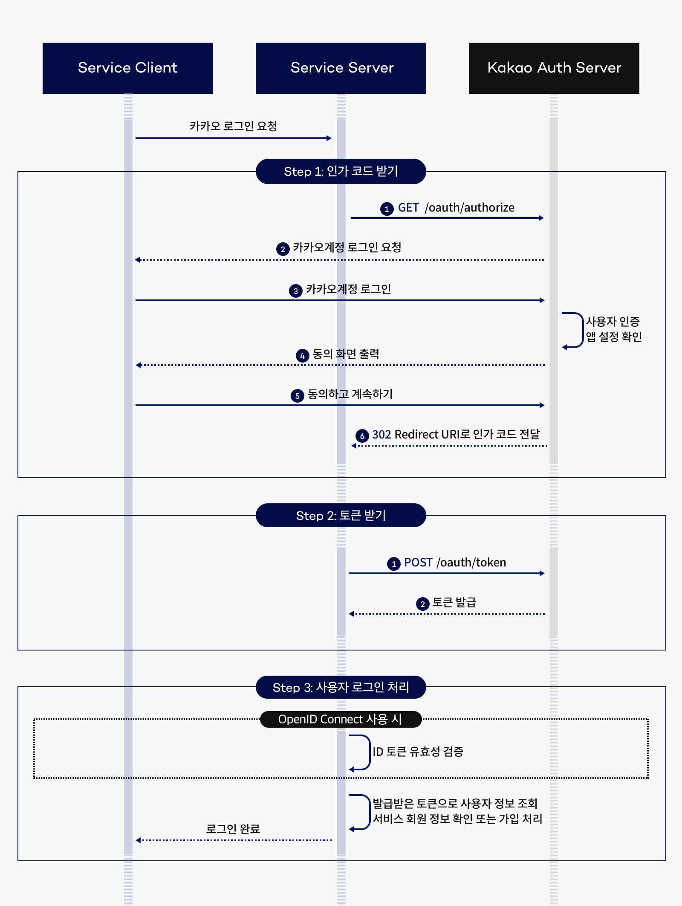
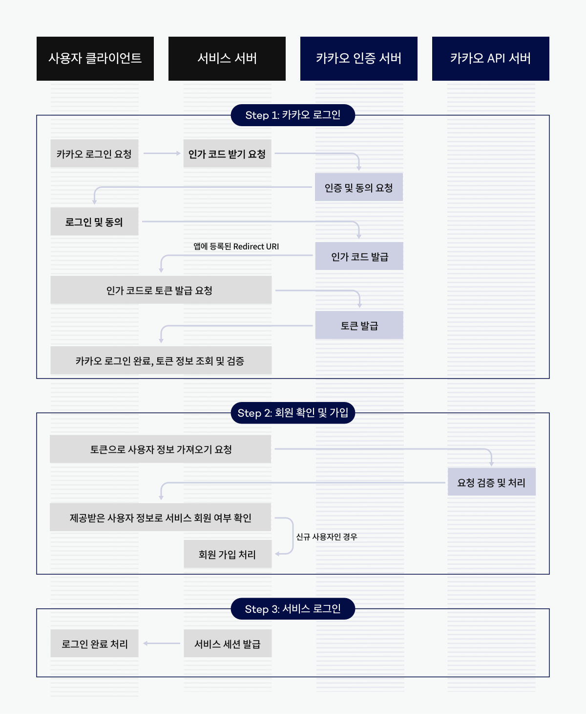

## [Spring Security] OAuth2.0 + JWT 로그인 구현하기
### OAuth 2.0이란?
- Google, Kakao 등의 외부 소셜 계정을 기반으로 하여 간편히 회원가입 및 로그인을 구현하는 프로토콜이다.
- OAuth 2.0은 1.0에서 알려진 보안 문제 등을 개선한 버전이다.

### Version
- Springboot 3.2.5
- Gradle 8.7
- Java 17
- Spring Security 6

### 카카오 소셜 로그인 흐름도
https://developers.kakao.com/docs/latest/ko/kakaologin/rest-api
  
  

### 로그인 동작 흐름
1. 사용자가 요청하면 Spring Security Filter에 등록된 JwtVerifyFilter를 거친다.
2. 일반 로그인이면 UserDetailsService, 소셜 로그인이면 OAuth2UserService을 거친다.  
3. loadUser() 메소드를 통해 사용자 정보를 가져와서 PrincipalDeetail 객체로 반환하는 역할을 한다.
4. 로그인을 성공하면 CommonSuccessHandler의 onAuthenticationSuccess()이 호출된다.
5. onAuthenticationSuccess()에서 Authentication에 담긴 PrincipalDetail을 추출해서 Access Token과 Refresh Token을 프론트로 넘겨준다.

### 설정 파일
application.yml
```yaml
spring:
  security:
    oauth2:
      client:
        provider:
          kakao:
            authorization-uri: https://kauth.kakao.com/oauth/authorize # 인가 코드를 얻기 위한 엔드포인트 URI
            token-uri: https://kauth.kakao.com/oauth/token # 인가 코드를 이용하여 액세스 토큰을 얻기 위한 토큰 endpoint
            user-info-uri: https://kapi.kakao.com/v2/user/me # 사용자 정보를 얻기 위한 URI
            user-name-attribute: id # 사용자의 고유 식별자
        registration:
          kakao:
            client-id: {REST_API_KEY} # Kakao에서 발급한 REST API Key (권한 요청에 필요하다.)
            client-secret: {CLIENT_SECRET} # Kakao에서 발급한 Client Secret (권한 요청에 필요하다.)
            client-authentication-method: client_secret_post # 클라이언트 인증 방법
            redirect-uri: http://localhost:8080/login/oauth2/code/kakao # 인증이 완료되고 리다이렉트될 URI
            authorization-grant-type: authorization_code # 인가 유형
            client-name: kakao # 클라이언트 이름
            scope: # 인가할 권한 범위
              - profile_nickname
              - account_email
```

### Spring Security 설정
SecurityConfig.java
```java
    @Bean
    public SecurityFilterChain securityFilterChain(HttpSecurity http) throws Exception {
        http.cors(httpSecurityCorsConfigurer -> httpSecurityCorsConfigurer.configurationSource(corsConfigurationSource()));
        http.csrf(AbstractHttpConfigurer::disable);
        http.sessionManagement(httpSecuritySessionManagementConfigurer -> {
            httpSecuritySessionManagementConfigurer.sessionCreationPolicy(SessionCreationPolicy.NEVER);
        });

        http.authorizeHttpRequests(authorizationManagerRequestMatcherRegistry ->
                authorizationManagerRequestMatcherRegistry.anyRequest().permitAll());

        http.addFilterBefore(jwtVerifyFilter(), UsernamePasswordAuthenticationFilter.class);

        http.formLogin(httpSecurityFormLoginConfigurer -> {httpSecurityFormLoginConfigurer
                        .loginPage("/login") // 사용자가 로그인을 하지 않은 상태에서 보안이 필요한 페이지에 접근했을 때 리다이렉션 될 URI
                        .successHandler(commonLoginSuccessHandler()) // 성공했을 때 핸들러
                        .failureHandler(commonLoginFailHandler()); // 실패했을 때 핸들러
        });

        http.oauth2Login(httpSecurityOAuth2LoginConfigurer ->
                httpSecurityOAuth2LoginConfigurer.loginPage("/oauth2/login")
                        .successHandler(commonLoginSuccessHandler())
                        .userInfoEndpoint(userInfoEndpointConfig ->
                                userInfoEndpointConfig.userService(oAuth2UserService)));

        return http.build();
    }
```

### 로그인 동작 흐름 상세 분석
**1.사용자가 요청하면 Spring Security Filter에 등록된 JwtVerifyFilter를 거친다.**
JwtVerifyFilter.java
```java
    @Override
    protected void doFilterInternal(HttpServletRequest request, HttpServletResponse response, FilterChain filterChain) throws ServletException, IOException {
        String authHeader = request.getHeader(JwtConstants.JWT_HEADER);

        try {
            checkAuthorizationHeader(authHeader);
            String token = JwtUtils.getTokenFromHeader(authHeader);
            Authentication authentication = JwtUtils.getAuthentication(token);

            SecurityContextHolder.getContext().setAuthentication(authentication);

            filterChain.doFilter(request, response);    // 다음 필터로 이동
        } catch (Exception e) {
            Gson gson = new Gson();
            String json = "";
            if (e instanceof CustomExpiredJwtException) {
                json = gson.toJson(Map.of("Token_Expired", e.getMessage()));
            } else {
                json = gson.toJson(Map.of("error", e.getMessage()));
            }

            response.setContentType("application/json; charset=UTF-8");
            PrintWriter printWriter = response.getWriter();
            printWriter.println(json);
            printWriter.close();
        }
    }
```

**2. 일반 로그인이면 UserDetailsService, 소셜 로그인이면 OAuth2UserService을 거친다.**  
**3. loadUser() 메소드를 통해 사용자 정보를 가져와서 PrincipalDeetail 객체로 반환하는 역할을 한다.**  
UserDetailsServiceImpl.java
```java
@Slf4j
@Service
@RequiredArgsConstructor
public class UserDetailsServiceImpl implements UserDetailsService {
    private final MemberRepository memberRepository;

    @Override
    public UserDetails loadUserByUsername(String username) throws UsernameNotFoundException {
        return memberRepository.findByEmail(username)
                .map(member -> new PrincipalDetail(member, Collections.singleton(new SimpleGrantedAuthority(member.getRole().getValue()))))
                .orElseThrow(() -> new UsernameNotFoundException("등록되지 않은 사용자입니다"));
    }
}
```

OAuth2UserService.java
```java
    @Override
    public OAuth2User loadUser(OAuth2UserRequest userRequest) throws OAuth2AuthenticationException {
        OAuth2User oAuth2User = super.loadUser(userRequest); // DefaultOAuth2UserService의 loadUser을 호출하여 사용자 정보 가져온다.
        Map<String, Object> attributes = oAuth2User.getAttributes(); // 사용자 정보에 담긴 속성들 꺼낸다.

        String userNameAttributeName = userRequest.getClientRegistration()
                .getProviderDetails()
                .getUserInfoEndpoint()
                .getUserNameAttributeName(); // OAuth2 서비스 제공 업체에서 사용자를 식별하는데 사용하는 속성이다. 카카오에서는 id를 사용한다.

        KakaoUserInfo kakaoUserInfo = new KakaoUserInfo(attributes); // 속성들을 이용해 KakaoUserInfo 객체를 생성한다.
        String socialId = kakaoUserInfo.getSocialId();
        String name = kakaoUserInfo.getName();

        Optional<Member> bySocialId = memberRepository.findBySocialId(socialId); // 추출한 정보를 이용해서 DB에 저장되어 있는지 검사한다.
        Member member = bySocialId.orElseGet(() -> saveSocialMember(socialId, name)); // 없으면 저장한다.

        return new PrincipalDetail(
                member,
                Collections.singleton(new SimpleGrantedAuthority(member.getRole().getValue())),
                attributes
        ); // PrincipalDetail을 반환한다.
    }
```

KakaoUserInfo 객체는 다음과 같은 속성들을 가진다.  
KakaoUserInfo.java
```java
public class KakaoUserInfo {
    public static String socialId;
    public static Map<String, Object> account;
    public static Map<String, Object> profile;

    public KakaoUserInfo(Map<String, Object> attributes) {
        socialId = String.valueOf(attributes.get("id"));
        account = (Map<String, Object>) attributes.get("kakao_account");
        profile = (Map<String, Object>) account.get("profile");
    }
    
    // 생략
}
```

Kakao에서 전달받는 데이터의 형태가 다음과 같기 때문이다.
```json
responseEntityBody = {
	id=30...
	connected_at=2024-02-01T11:23:54Z
	properties={nickname=XXXX}
	kakao_account={
		profile_nickname_needs_agreement=false
		profile={nickname=XXXX}
		has_email=true
		email_needs_agreement=false
		is_email_valid=true
		is_email_verified=true
		email=XXXX
	}
}
```

**4. 로그인을 성공하면 CommonSuccessHandler의 onAuthenticationSuccess()이 호출된다.**  
**5. onAuthenticationSuccess()에서 Authentication에 담긴 PrincipalDetail을 추출해서 Access Token과 Refresh Token을 프론트로 넘겨준다.**  
SecurityConfig.java에서 미리 핸들러 등록을 하였기 때문에 로그인에 성공하면 다음의 핸들러가 호출된다.
```java
        http.formLogin(httpSecurityFormLoginConfigurer -> {httpSecurityFormLoginConfigurer
                        .loginPage("/login")
                        .successHandler(commonLoginSuccessHandler())
                        .failureHandler(commonLoginFailHandler());
        });

        http.oauth2Login(httpSecurityOAuth2LoginConfigurer ->
                httpSecurityOAuth2LoginConfigurer.loginPage("/oauth2/login")
                        .successHandler(commonLoginSuccessHandler())
                        .userInfoEndpoint(userInfoEndpointConfig ->
                                userInfoEndpointConfig.userService(oAuth2UserService)));
```

CommonLoginSuccessHandler.java
```java
    @Override
    public void onAuthenticationSuccess(HttpServletRequest request,
                                        HttpServletResponse response,
                                        Authentication authentication) throws IOException, ServletException {
        PrincipalDetail principal = (PrincipalDetail) authentication.getPrincipal(); // Authentication 객체에서 PrincipalDetail 객체를 추출한다.

        log.info("authentication.getPrincipal() = {}", principal);

        Map<String, Object> responseMap = principal.getMemberInfo(); // 추출된 정보를 이용하여
        responseMap.put("accessToken", JwtUtils.generateToken(responseMap, JwtConstants.ACCESS_EXP_TIME)); // 액세스 토큰과
        responseMap.put("refreshToken", JwtUtils.generateToken(responseMap, JwtConstants.REFRESH_EXP_TIME)); // 리프레쉬 토큰 생성한다.

        Gson gson = new Gson();
        String json = gson.toJson(responseMap); // 추출된 정보와 JWT 토큰을 전달한다.

        response.setContentType("application/json; charset=UTF-8");

        PrintWriter writer = response.getWriter();
        writer.println(json);
        writer.flush();
    }
```

PrincipalDetail 객체의 역할은 다음과 같다.  
PrincipalDetail.java
```java
@Data
public class PrincipalDetail implements UserDetails, OAuth2User {
    private Member member; // 사용자의 정보를 담기 위한 Member
    private Collection<? extends GrantedAuthority> authorities; // 권한 정보를 담기 위한 authorities
    private Map<String, Object> attributes; // OAuth 2.0 제공자로부터 받아온 사용자 정보를 저장하는 attributes

    public PrincipalDetail(Member member, Collection<? extends GrantedAuthority> authorities) { // 일반 로그인 사용시
        this.member = member;
        this.authorities = authorities;
    }

    public PrincipalDetail(Member member, Collection<? extends GrantedAuthority> authorities, Map<String, Object> attributes) { // 소셜 로그인 사용시
        this.member = member;
        this.authorities = authorities;
        this.attributes = attributes;
    }

    public Map<String, Object> getMemberInfo() {
        Map<String, Object> info = new HashMap<>();
        return info;
    }

    // 생략
}
```

다시 1번으로 돌아와서 JwtVerifyFilter의 역할은 다음과 같다.  
JwtVerifyFilter.java
```java
    // "/signUp", "/login" , "/refresh", "/", "/index.html"에서는 해당 필터가 무시된다.
    @Override
    protected void doFilterInternal(HttpServletRequest request, HttpServletResponse response, FilterChain filterChain) throws ServletException, IOException {
        String authHeader = request.getHeader(JwtConstants.JWT_HEADER);

        try {
            checkAuthorizationHeader(authHeader); // header가 올바른 형식인지 체크한다.
            String token = JwtUtils.getTokenFromHeader(authHeader); // 토큰을 검증한다.
            Authentication authentication = JwtUtils.getAuthentication(token); // Security Context에 저장할 Authentication 객체를 생성한다.

            SecurityContextHolder.getContext().setAuthentication(authentication);

            filterChain.doFilter(request, response); // 다음 필터로 이동
        } 
        
        // 생략
    }
```

Spring Security 필터 순서는 다음과 같다.
> CorsFilter  
> CsrfFilter  
> SessionManagementFilter  
> SecurityContextPersistenceFilter  
> LogoutFilter  
> UsernamePasswordAuthenticationFilter  
> OAuth2AuthenticationFilter  
> JwtVerifyFilter

---
### 구현 결과


---
참고 블로그
- https://velog.io/@hj_/Spring-Security-OAuth2.0-JWT-%EB%A1%9C%EA%B7%B8%EC%9D%B8-ver.-SpringBoot-3.2.2
- https://daramgda.tistory.com/80
- https://ksh-coding.tistory.com/66
- https://ttl-blog.tistory.com/1434w
- https://stack94.tistory.com/entry/React-%EC%B9%B4%EC%B9%B4%EC%98%A4Kakao-%EB%A1%9C%EA%B7%B8%EC%9D%B8-%EA%B5%AC%ED%98%84%ED%95%B4%EB%B3%B4%EA%B8%B0
